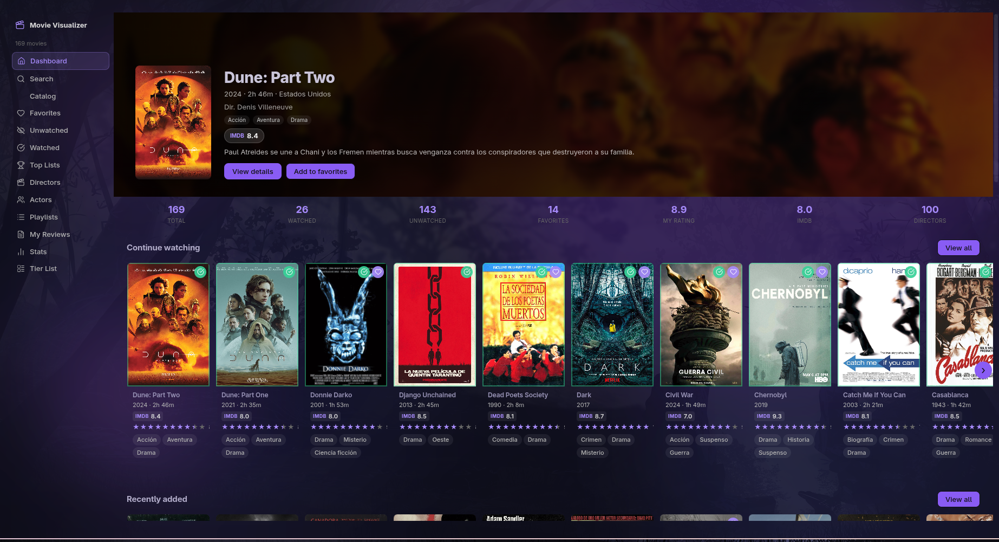
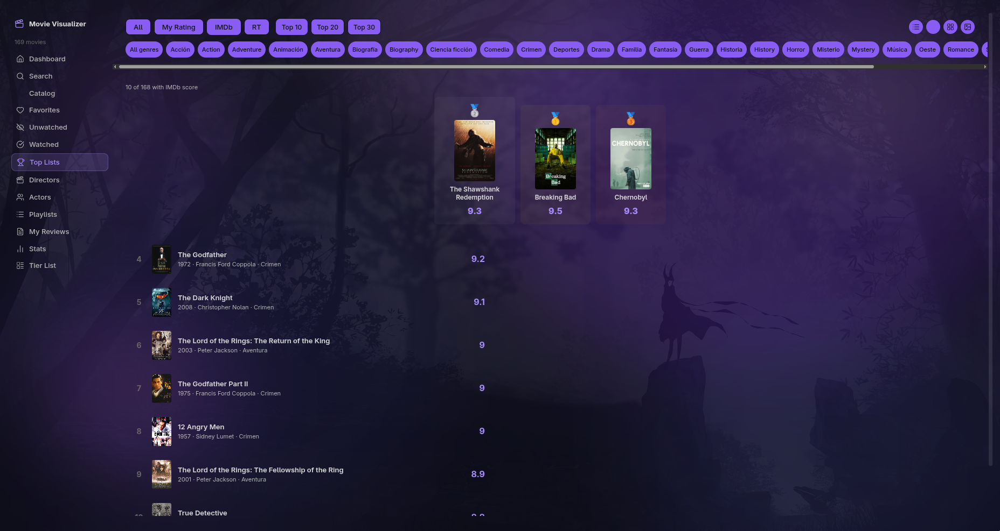
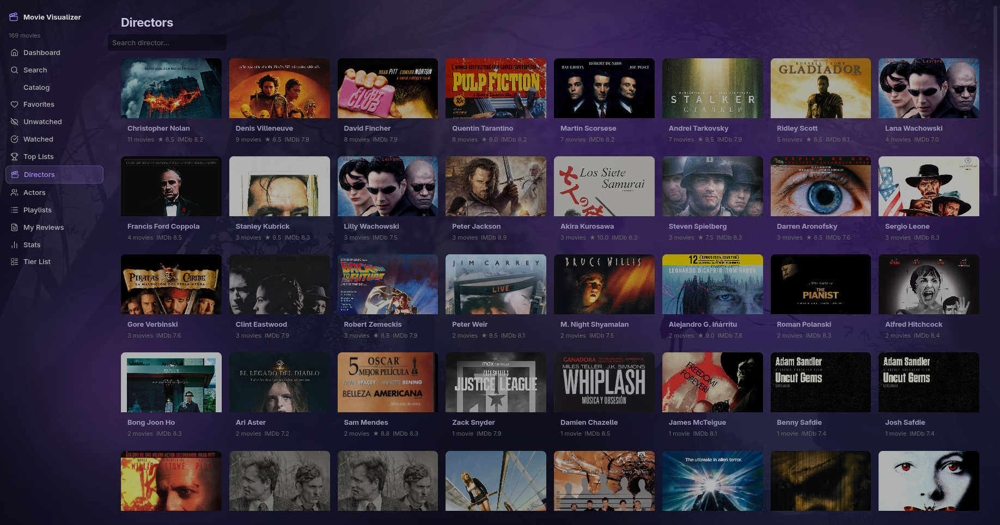
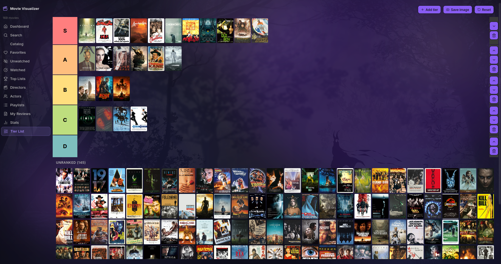

A visual movie catalog plugin for [Obsidian](https://obsidian.md). Turn your movie notes into a full-featured cinema dashboard — with hero banners, carousels, top lists, director stats, tier lists, and more.

> **No external services required.** Everything is read directly from the frontmatter of your vault notes.

---


<video src="docs/preview.mp4" controls width="100%"></video>

---

## Views

### Dashboard


### Top List


### Directors


### Tier List


---

## Features

### Dashboard
- **Hero section** — highlights your last watched or highest rated movie with backdrop image
- **Stats bar** — total, watched, unwatched, favorites, average personal rating, average IMDb, unique directors
- **Carousels** — Recently Watched, Top Rated, Favorites, Unwatched — all horizontally scrollable

### Catalog
- Full grid view of all your movies
- Filter by genre, status (watched / unwatched / favorites), year range, rating, runtime length, director, cast, and free-text search
- Sort by title, year, IMDb score, RT score, personal rating, runtime, last watched, times watched
- Four display modes: **Large Grid**, **Compact Grid**, **List**, **Poster**

### Top List
- Rank your movies by: **All** (combined), **My Rating**, **IMDb**, **RT**
- Filter by genre
- Three size presets: Top 10, Top 20, Top 30
- Four view modes: **Rank** (numbered list with drag reorder), **Large Grid**, **Compact Grid**, **Poster**
- Custom drag-and-drop ordering saved per vault
- Half-star rating display (supports 0.5 steps)

### Directors
- Cards for every director in your catalog
- Shows movie count, average personal rating, average IMDb score
- Click a director card to see all their movies

### Actors
- Same as Directors but for cast members

### Tier List
- Drag-and-drop tier list with customizable tier labels and colors
- Default tiers: S / A / B / C / D
- State is saved per vault

### Reviews
- Aggregated view of all movies that have a `review` field
- Sorted by personal rating descending

### Stats
- Rating distribution chart
- Movies by year
- Top directors breakdown
- Genre breakdown

### Search
- Global full-text search across title, director, cast, genre, and plot

### Movie Detail
- Full detail view for any movie: cover, backdrop, trailer link, all scores, cast, plot, awards, user review, mood, watch history

---

## Installation

### Manual (recommended for now)

1. Download the latest release from the [Releases](../../releases) page
2. Extract `main.js`, `styles.css`, and `manifest.json` into your vault at:
   ```
   <your-vault>/.obsidian/plugins/ldr-obsidian-movie-visualizer/
   ```
3. In Obsidian: **Settings → Community Plugins → enable** `LDR | Movie Visualizer`
4. Click the **clapperboard** icon in the left ribbon, or run the command `Open Movie Visualizer`

### Build from source

```bash
git clone https://github.com/ldr-devx/ldr-obsidian-movie-visualizer.git
cd ldr-obsidian-movie-visualizer
npm install
npm run build
```

Copy `main.js`, `styles.css`, and `manifest.json` to your plugin folder.

---

## Setup — Movie Notes

The plugin reads **any note in your vault** that has `categories` containing `Movies` in its frontmatter.

### Required field

```yaml
categories:
  - Movies
```

### Full frontmatter reference

```yaml
---
title: Ran
titleOriginal: 乱
imdbId: tt0089881

year: 1985
runtime: PT2H42M    # ISO 8601 duration, or plain minutes (162)
country: Japan
language: Japanese
director:
  - Akira Kurosawa
writer:
  - Akira Kurosawa
cast:
  - Tatsuya Nakadai
  - Akira Terao
genre:
  - Drama
  - War
productionCompany: Herald Ace

scoreImdb: 8.2
scoreRT: 97
scoreMetacritic: 96
rating: 10           # your personal score 1–10 (supports 0.5 steps)

cover: https://...   # poster image URL
coverBackdrop: https://...
trailer: https://...

favorite: true
watchlist: 2024-01-15   # ISO date — when you added it to your list
last: 2024-03-20        # ISO date — last time you watched it
timesWatched: 2
review: A towering achievement in world cinema.
mood: contemplative

plot: In feudal Japan, an aging warlord retires...
awards: Nominated for 4 Oscars.
tags:
  - criterion
  - masterpiece
categories:
  - Movies
---
```

Only `categories: [Movies]` is truly required. Every other field is optional — the plugin handles missing values gracefully.

---

## Obsidian Clipper Integration

The included `clipper.json` template lets you clip any **IMDb** movie page directly into a properly formatted vault note using the [Obsidian Clipper](https://obsidian.md/clipper) browser extension.

1. Open the Obsidian Clipper extension settings
2. Go to **Templates → Import**
3. Import `clipper.json` from this repository
4. Navigate to any IMDb movie page and clip it

The template auto-fills: title, year, director, cast, genre, plot, IMDb score, runtime, cover image, and sets `categories: [Movies]`.

---

## Obsidian Base View

The included `Movies.base` file provides a companion database view for your movie notes. It includes pre-built table views: **All**, **To-watch**, **Favorites**, **Last seen**, **By Director**, **By Genre**, **By Actor**.

Copy `Movies.base` to any folder inside your vault (e.g. `Movies/Movies.base`).

---

## Compatibility

| Obsidian version | Status |
|-----------------|--------|
| 1.4.0+          | Supported |
| Desktop         | Supported |
| Mobile          | Supported |

---

## Contributing

Pull requests are welcome. For major changes, please open an issue first.

```bash
npm run dev   # watch mode
npm run build # production build
```

---

## License

[MIT](LICENSE) — © 2026 LDR_Dev
